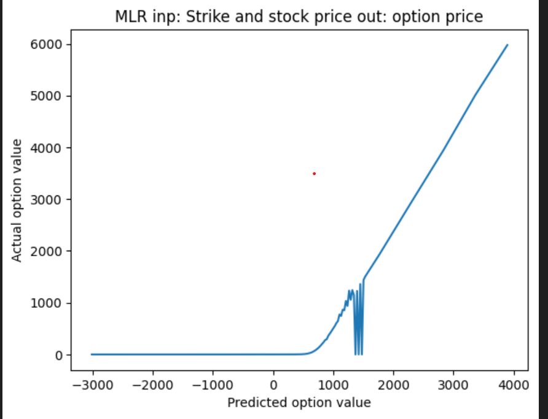

MLR with strike price, stock price as input and option value as output

Tested for NIFTY 50: 25/03/2023 expiry : 25/03/2023 with underlying asset price : 16945.5
Inference: There is neagtive value appearing as option value after strike price became less than 18500

  
